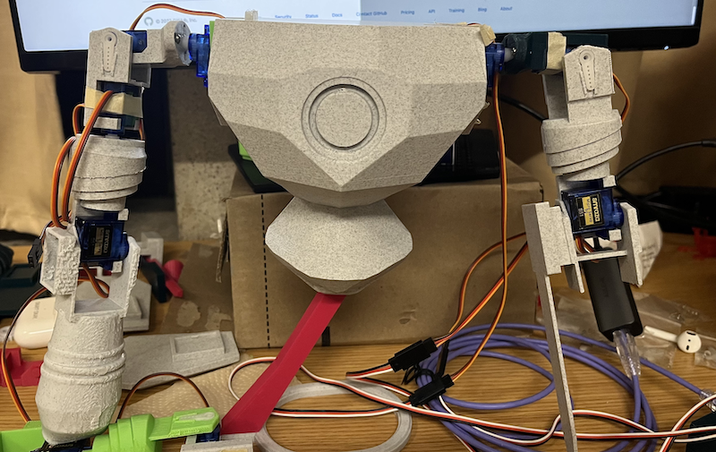

# caramel MECCHiato - A Mecha Project

#### Commands

- Initialize      (resets all servos)
- Calibrate       (run tests on all servos)
- Run diagnostics (move all servos simultaneously)
- extend sword
- raise <part_name_joined>
- lower <part_name_joined>

