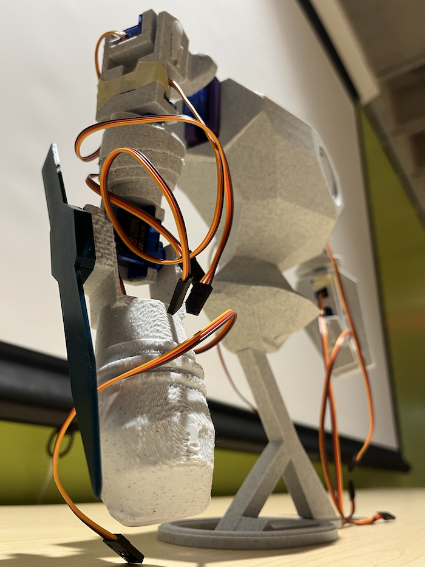

# Caramel MECCHiato - A Mecha Project

  A voice-controlled mecha, 3D modeled and printed by myself!  
  6 iterations were created, with modular arms and attachments that can be swapped out for each other.  
  There were unsuccessful attempts at using electromagnets to do even cooler stuff.  

  

<b><i>- Named caramel mecchiato because i like caramel macchiatos</i></b>

  
  

  
  
  

  
  

  
  

  

#### Commands

- Initialize      (resets all servos)
- Calibrate       (run tests on all servos)
- Run diagnostics (move all servos simultaneously)
- extend sword
- raise <part_name_joined>
- lower <part_name_joined>

